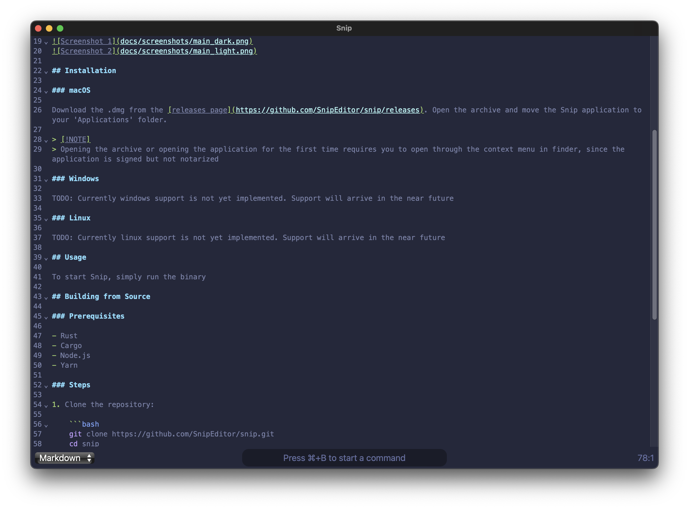
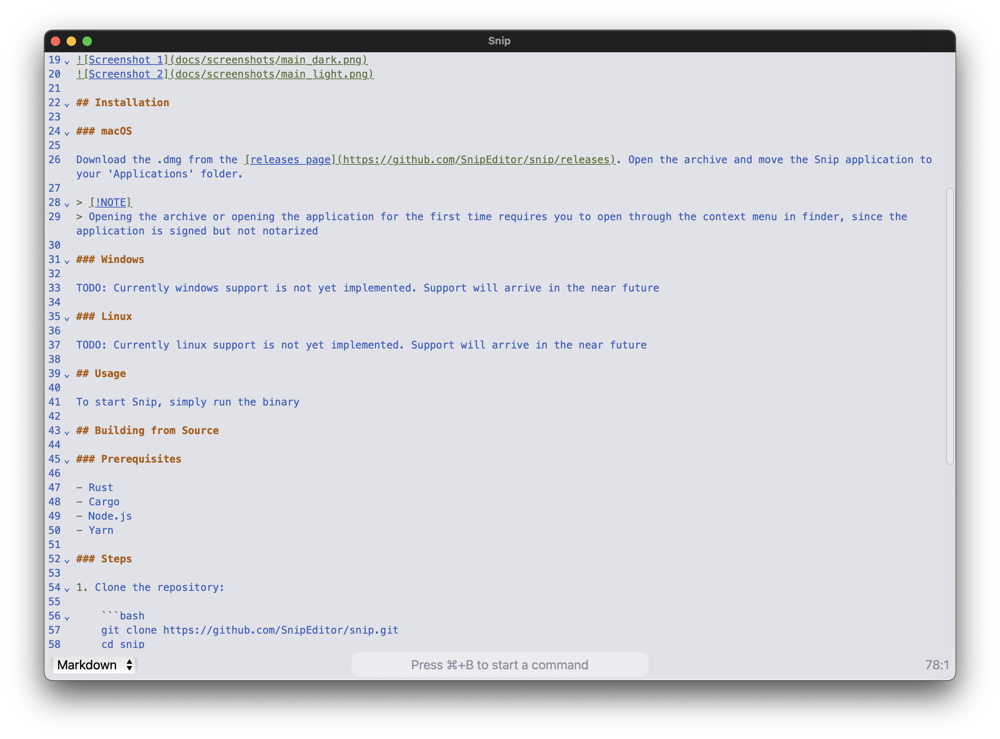

# Snip

Snip is a simple, cross-platform text editor inspired by Boop. It aims to improve on Boop by adding cross-platform support, better handling of large files, enhanced syntax highlighting, and the ability to operate on files. Snip maintains a focus on easy scripting, quick startup, and usefulness as a small notepad for copying and editing snippets.

## Features

- **Cross-Platform Support**: Available on macOS, Windows, and Linux.
- **Handling of Large Files**: Efficiently handles large files without performance degradation.
- **Syntax Highlighting**: Syntax highlighting for various programming languages.
- **File Operations**[^1]: Ability to open, edit, and save files.
- **Easy Scripting**: Simple and powerful scripting capabilities.
- **Quick Startup**: Fast startup time, making it ideal for quick edits.
- **Notepad Functionality**: Useful as a small notepad for copying and editing snippets.

[^1]: Not yet supported, but coming soon

## Screenshots




## Installation

### macOS

Download the .dmg from the [releases page](https://github.com/SnipEditor/snip/releases). Open the archive and move the Snip application to your 'Applications' folder.

> [!NOTE]
> Opening the archive or opening the application for the first time requires you to open through the context menu in finder, since the application is signed but not notarized

### Windows

Download the .msi for your cpu architecture from the [releases page](https://github.com/SnipEditor/snip/releases). Open it and follow the installation instructions.

### Linux

#### Debian-based operating systems

Download the .deb for your cpu architecture from the [releases page](https://github.com/SnipEditor/snip/releases).
Run the following command with `<file>` replaced with the path to the downloaded .deb file:

```bash
sudo dpkg -i <file>
```

#### Red Hat based operating systems

Download the .rpm for your cpu architecture from the [releases page](https://github.com/SnipEditor/snip/releases).
Run the following command with `<file>` replaced with the path to the downloaded .rpm file:

```bash
sudo rpm -i <file>
```

## Usage

To start Snip, simply run it from your application list

## Building from Source

### Prerequisites

- Rust
- Cargo
- Node.js
- Yarn

### Steps

1. Clone the repository:

   ```bash
   git clone https://github.com/SnipEditor/snip.git
   cd snip
   ```

2. Install dependencies:

   ```bash
   yarn install
   ```

3. Run the application in development mode:

   ```bash
   yarn tauri dev
   ```

4. (To build a standalone executable):

   ```bash
   yarn tauri build
   ```

## License

This project is licensed under the MIT License. See the [LICENSE](LICENSE) file for details.

## Acknowledgements

- Inspired by [Boop](https://github.com/IvanMathy/Boop)
